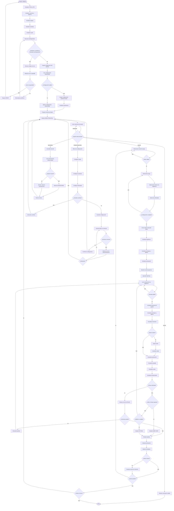

# Tareas-Electrónica-Digital-I
Diagrama de Flujo del sistema FPGA

```mermaid
graph TD;
    A([INICIO / RESET]) --> A1[Inicializar FPGA y CPU]
A1 --> A2[Inicializar memoria y registros]
A2 --> A3[Inicializar display]
A3 --> A4[Inicializar controles]
A4 --> A5[Inicializar audio]
A5 --> A6[Ejecutar autodiagnóstico]

A6 --> A7{¿Hardware y periféricos funcionan correctamente?}

A7 -- NO --> A8[Generar código de error]
A8 --> A9[Mostrar error en pantalla]
A9 --> A10{¿Error recuperable?}
A10 -- NO --> A11[Esperar RESET]
A11 --> A
A10 -- SI --> A12[Reinicializar periférico]
A12 --> A6

A7 -- SI --> B1[Cargar configuración del sistema]

B1 --> B2[Leer configuración almacenada]
B2 --> B3{¿Configuración válida?}

B3 -- NO --> B4[Cargar configuración predeterminada]
B4 --> B5[Inicializar parámetros]
B5 --> B6[Preparar interfaz principal]

B3 -- SI --> B7[Aplicar configuración almacenada]
B7 --> B6

B6 --> C1[Mostrar MENÚ PRINCIPAL]
C1 --> C2[Leer controles del usuario]
C2 --> C3{¿Opción seleccionada?}

C3 -- JUGAR --> D1[Seleccionar modo de juego]
C3 -- CONFIGURACION --> F1[Menú de configuración]
C3 -- RECORDS --> G1[Consultar récords]
C3 -- SALIR --> C4[Mostrar mensaje de salida]
C4 --> C5([FIN ])

C3 -- NINGUNA --> C2

D1 --> D2{¿Modo válido?}

D2 -- NO --> D1
D2 -- SI --> D3[Seleccionar juego]

D3 --> D4[Seleccionar Número de Jugadores]
D4 --> D5[Seleccionar dificultad]
D5 --> D7{¿Configuración completa?}

D7 -- NO --> D3
D7 -- SI --> D8[Crear estado inicial del juego]

D8 --> D9[Inicializar jugadores]
D9 --> D10[Inicializar enemigos y objetos]
D10 --> D11[Inicializar puntuación]
D11 --> D14[Ejecutar cuenta regresiva]

D14 --> H1[INICIAR PARTIDA]

H1 --> H2[Leer controles de los jugadores]
H2 --> H3{¿Entrada válida?}

H3 -- NO --> H2
H3 -- SI --> H4[Actualizar posición del jugador]

H4 --> H5[Actualizar enemigos y objetos]
H5 --> H6[Actualizar escenario]
H6 --> H8{¿Existe colisión?}

H8 -- SI --> H9[Aplicar daño]
H9 --> H10[Actualizar vidas]
H10 --> H11[Actualizar puntuación]

H8 -- NO --> H11

H11 --> H12[Actualizar pantalla]
H12 --> H13[Actualizar audio]
H13 --> H14[Actualizar temporizador]

H14 --> H15{¿Pausa solicitada?}

H15 -- SI --> H16[Mostrar menú de PAUSA]
H16 --> H17{¿Continuar partida?}

H17 -- SI --> H18[Reanudar partida]
H18 --> H2

H17 -- NO --> I1[Finalizar partida]

H15 -- NO --> H19{¿Vidas o tiempo agotado?}

H19 -- SI --> H20[Estado GAME OVER]
H20 --> I1

H19 -- NO --> H23{¿Objetivo cumplido?}

H23 -- SI --> H24[Estado VICTORIA]
H24 --> I1

H23 -- NO --> H2


F1 --> F2[Configurar audio]
F2 --> F4[Configurar controles]
F4 --> F5[Configurar dificultad]

F5 --> F6{¿Guardar cambios?}

F6 -- NO --> F7[Descartar cambios]
F7 --> C1

F6 -- SI --> F8[Guardar configuración]
F8 --> F9[Escribir datos en memoria]

F9 --> F10{¿Escritura correcta?}

F10 -- NO --> F11[Mostrar error de almacenamiento]
F11 --> F12{¿Reintentar?}

F12 -- SI --> F9
F12 -- NO --> C1

F10 -- SI --> F13[Confirmar configuración]
F13 --> C1

G1 --> G2[Leer puntuaciones almacenadas]
G2 --> G3{¿Existen récords?}

G3 -- NO --> G4[Mostrar SIN RECORDS]
G4 --> G5[Volver al menú]
G5 --> C1

G3 -- SI --> G6[Mostrar mejores puntuaciones]
G6 -->  G5

I1 --> I2[Calcular puntuación]
I2 --> I4[Mostrar resultados]

I4 --> I5{¿Nuevo récord?}

I5 -- NO --> I11{¿Nueva partida?}

I5 -- SI --> I7[Guardar récord en memoria]

I7 --> I11

I11 -- SI --> D1
I11 -- NO --> I12{¿Volver al menú?}

I12 -- SI --> C1
I12 -- NO --> C5
```
